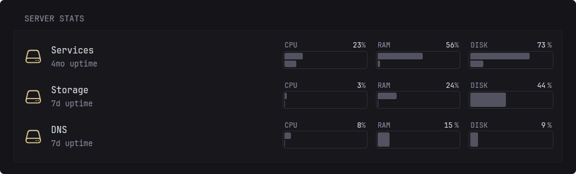

<p align="center"></p>
<h1 align="center">luna Agent</h1>
<p align="center">
  <a href="#installation">Install</a> •
  <a href="#configuration">Configuration</a> •
  <a href="#api">API</a>
</p>

<p align="center">A lightweight service that exposes system metrics via an HTTP API,<br> intended to be used with luna's server stats widget</p>

<br>

<p align="center"></p>

<br>

## Installation
Choose one of the following methods:

<details>
<summary><strong>Docker container</strong></summary>
<br>


> [!NOTE]
>
> So long as the container hasn't been restricted, the reported CPU load and memory usage should match those of the host. For disk usage, you'll need to mount the relevant mountpoints into the container.

```yml
services:
  luna-agent:
    container_name: luna-agent
    image: ghcr.io/luna-page/agent:latest
    environment:
      # Optional, leave empty or comment out for no authentication
      TOKEN: your_auth_token_here
    volumes:
      # Add your mount points below in the format host_path:container_path with :ro suffix for read-only
      - /storage:/storage:ro
    ports:
      - 27973:27973
```

Then, add the following entry to your `servers` list in luna's `server-stats` widget:

```yml
- type: remote
  name: Custom Server Name
  url: http://<server IP or domain>:27973
  token: <token from above, if set>
```

### Synology DSM (Container Manager)

1. Open **Container Manager** → **Project** → **Create**.
2. Paste the same compose file shown above.
3. Set the volume mappings to paths that exist on your NAS (for example, `/volume1` paths).
4. Deploy the project and ensure port `27973` is allowed by DSM firewall/network settings.

Ready-to-copy example file:

- [`examples/platforms/synology/docker-compose.yml`](examples/platforms/synology/docker-compose.yml)

> [!TIP]
>
> On Synology, `agent install` is not supported because DSM does not use systemd. Use the Docker method.

### Unraid (Docker)

Use either of these approaches:

- **Docker tab**: Add a container using image `ghcr.io/luna-page/agent:latest`, map host port `27973` to container port `27973`, and add any volume mappings you want to monitor.
- **Compose Manager plugin**: Use the same compose snippet above.

After starting the container, add the same `server-stats` entry shown above using your Unraid host IP.

Ready-to-copy Community Apps template XML:

- [`examples/platforms/unraid/luna-agent.xml`](examples/platforms/unraid/luna-agent.xml)

#### How to import the Unraid XML template

1. Open **Unraid Web UI** → **Docker**.
2. Click **Add Container**.
3. In **Template**, select **User Templates** (or your custom templates folder).
4. Click the template selector and choose **Import XML Template** (or **Edit** → paste XML, depending on Unraid version).
5. Paste the contents of `examples/platforms/unraid/luna-agent.xml` and save.
6. Review port/path/token values, then click **Apply**.
7. Once started, verify `http://<unraid-ip>:27973/api/healthz` returns `200 OK`.

If you need the on-disk template folder, common locations are `/boot/config/plugins/dockerMan/templates-user/` (typical Unraid 6.x) and `/boot/config/plugins/community.applications/private/` (Community Apps cache).

If the template is not showing in the dropdown:

- Make sure the XML file extension is exactly `.xml`.
- Refresh the Docker page (or restart the Docker service from **Settings** → **Docker**).
- Confirm the file is in `templates-user` and readable.
- Re-open **Add Container** and switch Template to **User Templates** again.

If you use **host** network mode in Unraid, container port mappings are ignored, so access the agent directly on `http://<unraid-ip>:27973` (or whatever `PORT` env var is set to).

<br>
</details>

<details>
<summary><strong>Automatic installation as a systemd service</strong></summary>

<br>

Download the latest release for your architecture from the [releases page](https://github.com/luna-page/agent/releases/latest), extract it, then run:

```bash
sudo ./agent install
```

> [!IMPORTANT]
>
> This installer is for Linux hosts running **systemd** only. For Synology DSM and Unraid, use the Docker container method.

And follow the instructions. When done, the agent can later be configured through the config file at:

```
/opt/luna-agent/agent.yml
```

*(default location unless changed during installation)*

**Service must be restarted after making changes to the config file**.

### Demo


> [!NOTE]
>
> To update the agent, you must download the latest release and replace the existing binary at `/opt/luna-agent/agent`. Then, restart the service with:

```bash
sudo systemctl restart luna-agent
```

<br>
</details>

<details>
<summary><strong>Manual installation</strong></summary>
<br>

Download the latest release for your architecture from the [releases page](https://github.com/luna-page/agent/releases/latest), extract it, then to run:

```bash
./agent --config /path/to/agent.yml
```

Alternatively, omit the `--config` and configure via environment variables as described below.

From here, to get it to start on boot, it's up to you whether you choose to create a systemd service or use another method.

</details>

<br>

## Build from source

### Prerequisites

- Go 1.24+
- A Linux system if you want to use `agent install` (systemd required)

### Build locally

```bash
git clone https://github.com/luna-page/agent.git
cd agent
go mod download
go build -o luna-agent .
```

Run with a config file:

```bash
./luna-agent --config /path/to/agent.yml
```

Or run with environment variables only (for example in containers):

```bash
PORT=27973 TOKEN=your_auth_token ./luna-agent
```

### Cross-compile examples

Build for Linux amd64:

```bash
CGO_ENABLED=0 GOOS=linux GOARCH=amd64 go build -o luna-agent-linux-amd64 .
```

Build for Linux arm64:

```bash
CGO_ENABLED=0 GOOS=linux GOARCH=arm64 go build -o luna-agent-linux-arm64 .
```

### Install from your own build (systemd hosts)

If you built the binary yourself and want the guided installer:

```bash
sudo ./luna-agent install
```

For non-systemd environments (Synology/Unraid), run your built binary manually or package it in a container.

<br>

## Configuration

### `agent.yml` options

```yml
server:
  # Leave blank to listen on all interfaces
  host:

  # Port to listen on
  port: 27973

  # Optional token for authenticating API requests
  token:

system:
  # When blank, the agent will attempt to infer the correct CPU temperature sensor, however
  # if it is unable to or it gets it wrong, you can override it using this option.
  # To list the available sensors, run `agent sensors:print`
  cpu-temp-sensor:

  # Whether to hide all mountpoints by default. Individual mountpoints
  # can then be shown using the `hide: false` option as seen below
  hide-mountpoints-by-default: false

  # List of mountpoints to show/hide in the API response, keyed by the mountpoint path
  # Optionally, also set a name to be displayed in the widget when hovering over the disk usage
  mountpoints:
    "/":
      hide: false
      name: Root
```

### Environment variables

#### `LOG_LEVEL`

To log additional errors, use `LOG_LEVEL=debug`.

### Using environment variables instead of a config file

If you haven't specified a config file or it does not exist, the agent will instead use the below environment variables for configuration, useful when running in a container.

#### `TOKEN`

Sets `server.token` in the config file. Defaults to an empty string (no authentication).

#### `PORT`

Sets `server.port` in the config file. Defaults to `27973`.

#### `TEMP_SENSOR`

Sets `system.cpu-temp-sensor` in the config file. Defaults to an empty string (auto-detect).

#### `HIDE_MOUNTPOINTS_BY_DEFAULT`

Sets `system.hide-mountpoints-by-default` in the config file. Defaults to `false`.

#### `MOUNTPOINTS`

Sets `system.mountpoints` in the config file. Accepts a comma-separated list of mountpoints, for example:

```
MOUNTPOINTS="/mnt/data, /mnt/backups"
```

If you set `HIDE_MOUNTPOINTS_BY_DEFAULT=true` then all mountpoints will be hidden by default, except for those specified in this variable.

> [!IMPORTANT]
>
> When inside a Docker container you must specify the mountpoints **mounted into the container**. For example, if in your docker-compose you have:
> ```yml
> volumes:
>   - /dir/on/host:/dir/in/container:ro
> ```
> then you must specify `/dir/in/container` in the `MOUNTPOINTS` environment variable.

To give a mountpoint a custom name, use the format `<mountpoint>:<name>`, for example:

```
MOUNTPOINTS="/mnt/data:Data, /mnt/backups:Backups"
```

To hide a mountpoint, use the prefix `!`, for example:

```
MOUNTPOINTS="/mnt/data:Data, !/etc/hostname"
```


> [!NOTE]
>
> When inside a Docker container, some common mountpoints such as `/etc/hosts`, `etc/hostname` and `/etc/resolv.conf` are automatically hidden.


<br>

## API

Although the agent was primarily built to be used with luna, you can still use its API to build your own monitoring solutions or custom widgets.

### Authentication

If a `token` is set in the configuration file, API requests must include an `Authorization` header with the value `Bearer <token>`.

### `GET /api/sysinfo/all`

Example response:

```json
{
  "host_info_is_available": true,
  "boot_time": 1758747502,
  "hostname": "raspberrypi",
  "platform": "raspbian",
  "cpu": {
    "load_is_available": true,
    "load1_percent": 6,
    "load15_percent": 2,
    "temperature_is_available": true,
    "temperature_c": 41
  },
  "memory": {
    "memory_is_available": true,
    "total_mb": 3794,
    "used_mb": 115,
    "used_percent": 3,
    "swap_is_available": true,
    "swap_total_mb": 99,
    "swap_used_mb": 0,
    "swap_used_percent": 0
  },
  "mountpoints": [
    {
      "path": "/",
      "name": "",
      "total_mb": 29689,
      "used_mb": 12548,
      "used_percent": 44
    }
  ]
}
```

### `GET /api/healthz`

Returns `200 OK` if the agent is running. This endpoint is used during the automatic installation to verify that the agent has started successfully.
